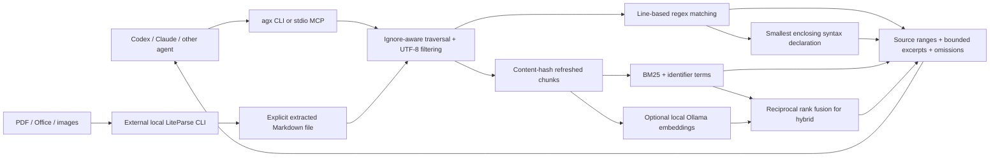

# Architecture

The calling agent supplies reasoning; the tool supplies bounded, verifiable evidence. Default retrieval stays local and requires no model.

## Language and dependencies

Rust gives us one native executable, bounded regex complexity, portable filesystem behavior, and no JS/Python runtime on the main path. The `ignore` crate is from ripgrep's ecosystem; `regex` is its common matching foundation. We implement our own agent contract around these libraries. This is not an embedded ripgrep executable or a full ripgrep compatibility layer.

Tree-sitter supplies syntax declarations in six language families. We walk named nodes, record recognized declarations with exact line slices, and choose the smallest enclosing declaration per matched line. A match outside supported syntax uses nearby source lines. Parser recovery is allowed; syntactic containment is not evidence of runtime behavior. Nested declarations remain searchable. Ranked chunks also include 80-line windows at a 60-line stride so top-level imports/configuration are not lost.

## Retrieval

Exact matching uses smart case by default; literal mode escapes regex metacharacters. No synthetic source summaries are generated. Source ranges are one-based and inclusive. Search caps file eligibility at 2 MiB and skips symlinks.

BM25 uses `k1=1.2`, `b=0.75`, query stop-word removal, camelCase and delimiter splitting, and additional symbol/path term boosts. It is deliberately lexical. It cannot infer arbitrary synonyms, types, or relationships.

Hybrid adds cosine similarity from an explicitly selected local Ollama model. Chunk inputs contain file path, optional symbol, and source. Embeddings are cached by model name and input hash. Reciprocal rank fusion sums `1 / (60 + rank)` for the top 100 entries of each ranking. Overlapping windows/declarations are suppressed to reduce repeated evidence. No approximate nearest-neighbor index is used; cosine ranking scans cached vectors. Empty/nonfinite or dimension-mismatched embedding responses are errors.

## Freshness and storage

Indexes are partitioned by canonical root and scope filters. Each refresh reads eligible source, hashes it with BLAKE3, reparses changed content, and prunes missing paths. Writes use an owner-only temporary file and atomic replacement. Invalid syntax caches rebuild with a warning. Different root/filter snapshots do not share result scopes. Concurrent refreshes may duplicate work; atomic writes prevent half-written caches, but there is no transactional filesystem snapshot.

JSON cache storage is simple and inspectable, but stores source verbatim. It needs replacement with an incremental SQLite/FTS or indexed postings implementation before claiming large-corpus performance. A watcher may speed refreshes, but must not hide stale evidence: query-time verification remains the correctness baseline.

## Interfaces

The CLI defaults to one JSON response. Source byte budgets and result limits are distinct and omission flags are explicit. A budget may clip a source prefix; full source coordinates remain available to `read`. Metadata is outside the source budget, so callers requiring a hard serialized response cap must add their own framing limit.

MCP uses newline-delimited JSON-RPC stdio. It supports initialization, notifications, ping, tool listing/calls, structured results, and tool errors. Incoming frames are capped at 1 MiB. The startup root is fixed; `read` canonicalizes targets and checks confinement, UTF-8, file size, and a maximum of 500 lines. The server exposes read operations; ranked searches can write local caches. Returned code and document text must be treated as untrusted data.

Skill installation preflights both destinations and preserves custom skills unless explicitly forced. It does not replace harness instructions or register MCP servers. Claude's local plugin manifest packages the same skill; Codex uses its native skills directory and MCP configuration.

## Documents

The adapter invokes LiteParse with structured subprocess arguments, preserving paths with spaces and preventing shell interpretation. It extracts to a temporary Markdown file, requires successful nonempty output, then persists without clobbering. Progress goes to stderr and a provenance summary goes to stdout. Markdown citations refer to extraction lines. It does not yet retain page/bounding-box evidence, extraction hashes, or a queryable provenance sidecar.
